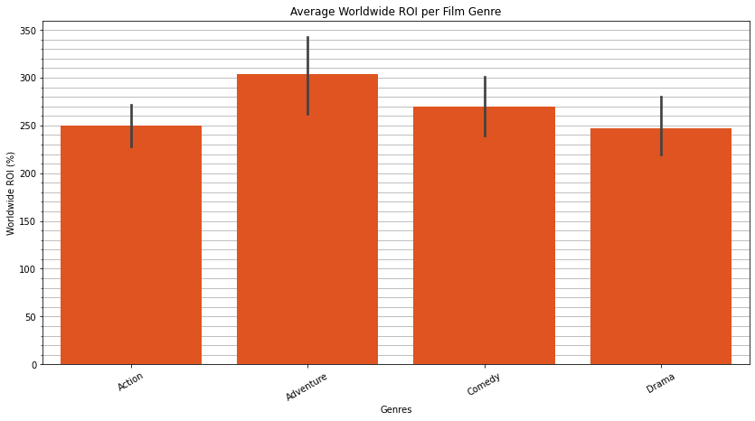
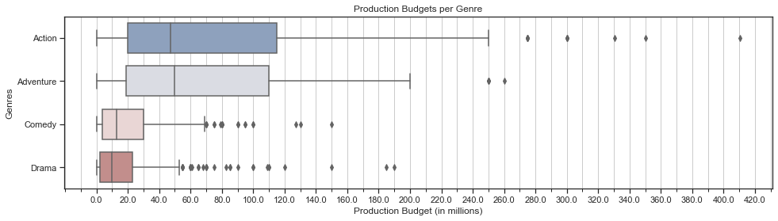
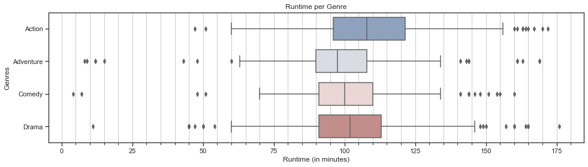

# Microsoft Film Analysis

**Author**: Andre Layton

GitHub: @therookiescientist-andre

## Overview

  Microsoft is creating a new movie studio division in an effort to compete with other big companies, like Apple and Amazon, that have been successfully putting out diverse media content. This project aims to analyze movie data from various sources and recommend the best type of film to create for the studio's initial content. The main focus behind the analysis is seeing which films are best to begin creating by calculating and comparing the returns on investment (ROI), measured in percentages. During the course of the analysis, the comparison shifted from both Domestic and Worldwide ROIs to solely on a worldwide level due to the size of the company and the competition. In addition, while a majority of the movies from The Numbers's movie budget dataset fell under Action, Comedy, Drama, or Adventure genres, which are the four most frequent genres in order, War and Mystery movies yielded the highest median ROIs, both domestically and worldwide. However, those genres were lacking enough records to draw conclusions from, shown through the high error bars in both visuals for each genre; as such, I focus on the genres with low error margins (like the top four mentioned earlier), and the results confirm Adventure as the best genre to begin with for global success and profit. To be more precise, I suggest merging genres to create an Adventure-Comedy film, in order to draw from both markets and audiences. Adventure films, on average, require a \\$70 million budget, but I am suggesting \\$100 million, at minimum, upwards to approximately \\$104 million, to generate triple the budget. The film itself should run between 95-110 minutes, which is significant in determing studio and production costs. 
  
## Business Problem

  Microsoft has created a movie studio; however, the executives are stuck on what type of content to begin creating and investing in. In order to compete with companies who have been dominating the space thus far, I am looking at the film genres that provide the highest return on investment (ROI), both domestically and globally, in order to recommend the best type of film for Microsoft to begin creating. The significance in selecting a genre with a high ROI lies in the impact it could have on future films - if the genre we recommend produces a high ROI for Microsoft, it encourages investors and invites conversations for further film production. It also assures the executives that Microsoft can compete in this space/industry.
***

## Data & Methods

  The data analysed came from both the IMDb and The Numbers websites. IMDb is a popular worldwide online database of infomation relating to all movies, television programs, video games and streaming content online. The Numbers, on the other hand, is a popular website that displays financial information related to films such as budget, domestic gross, worldwide gross, and etc. I used 1 file from IMDb and 1 file from The Numbers to answer the question of which genres were most successful, mainly focusing on the Domestic and Worldwide Gross sales along with budget.

  After cleaning the information on each table such as column names and missing data, I joined the two datasets with a shared field, budgets_df3 and movie_basics_df together using the 'Movie Name' column as it was a unique identifier creating a new dataframe called final_df. However, I created a final_df2 and final_df3 where median ROIs for both domestic and worldwide levels, respectively, are filtered and refined for plotting. 
***

## Results

  The first few plots depict the median ROIs on both scopes, as well as the average Worldwide ROI by genre, which we later refined our analysis view to. All three plots support that Adventure films are the best type to begin creating among the top four mentioned earlier, with Comedy coming in second, as measured through this analysis. This would also invite conversations of merging the two genres, given the dataset initially had multiple genres. 

  The next few visuals - the boxplot and multiple regression plots - exhibit how production budgets vary among the top four genres, and the bar chart shows that the Adventure films in the dataset required $70 million for production, on average. However, I am suggesting a production budget between $100-140 million, in order to potentially generate four times the investment (at minimum a triple return on invesmtment).

  The final boxplot statistically, and visually, breaks down the runtime among the top four genres. A runtime between 95-110 minutes would be best for this initial project, which would cover the 75th percentile of Adventure films as well as Comedy films if we were to further suggest merging genres for the screenplay, as mentioned earlier. 

To improve confidence in the results next time I would:

  Include the movie ratings and refine to include multiple genre characterizations in order to give a clear, more comprehensive picture of the dataset. In addition, research when might be the best time to release to give a refined projection/plan.

***


## Conclusions

This analysis leads to three recommendations regarding types of movies that are best to begin creating:

1. START WITH ADVENTURE-COMEDY FILMS. Adventure films generate the highest median worldwide return on investment, among the top four genres. We focused our analysis to those four genres due to a lack of records for the other genres, and their susceptibility to outliers (e.g., low budget films that found major success), to confidently include them in the analysis. As such, Adventure films were the best choice to begin with, and is estimated to produce both the highest median and average worldwide returns - suggesting the film will make enough to cover production costs and even generate profit. I would further suggest merging genres with Comedy for the screenplay, which will allow us to draw from different demographics and markets to gain success/following from. Therefore, an Adventure-Comedy film.

<kbd>

</kbd>
    
2. BUDGET SUGGESTIONS. According to the average budget and Worldwide ROI visuals above, prepare to spend a minimum of $70 million on this film in order to double the return on investment. However, I am suggesting a budget plan between $100-140 million, in order to make, approximately, three times the budget at the minimum and a ceiling projected at quadruple the investment. 



3. RUNTIME SUGGESTIONS. I am suggesting a minimum runtime of approximately 95 minutes for the Adventure film. However, if we follow my earlier suggestion regarding merging genres, an Adventure-Comedy film would require a runtime between 95-110 minutes. 



***


## Repository Contents
***
Below is a list of the contents of this repository.

```
├── README.md             
├── images   
├── .gitignore         
├── Microsoft Film Analysis - Notebook.ipynb                               
└── Microsoft Film Analysis.pdf                         
```
